#  LEGO-Net: Canonical Arrangement

This holds the implementation for [LEGO-Net: Learning Regular Rearrangements of Objects in Rooms](https://ivl.cs.brown.edu/#/projects/lego-net).

<br>

---
<br>

## Environment
Install the conda environment <br>
```
conda env create -n CanonicalArrangements --file environment.yml
conda activate CanonicalArrangements
```
Modify ``filepath.py`` accordingly.

<br>

## Downloads
Downloadable assets may be found at [this google drive](https://drive.google.com/drive/folders/1MmSb6461ixGGqGa5hRY3s0IR4xTeRdPF?usp=sharing). It contains:
* Preprocessed 3D-FRONT data: ``3DFRONT_65347``
* Precomputed Condor features (only needed for tablechair_shape): ``Table.h5``, ``Chair.h5``


<br>

## Datasets

* `3dfront`: [3D-FRONT dataset](https://tianchi.aliyun.com/specials/promotion/alibaba-3d-scene-dataset) (professionally designed indoor scenes); currently support bedroom and livingroom. [Here](https://tianchi.aliyun.com/dataset/65347) is the exact version used for experimentation.

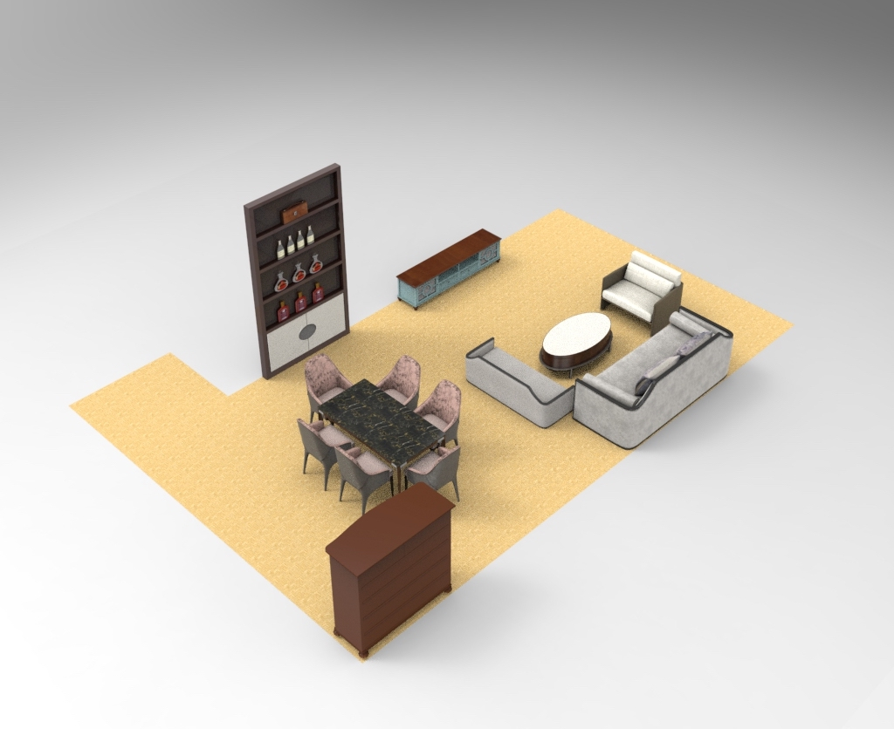

<br>

* `tablechair_horizontal`: 'Symmetry & Parallelism'. 2 tables with 6 chairs each in rectangular formation (fixed relative distance).
* `tablechair_circle`: 'Uniform Spacing'. 2 tables with 2-6 chairs each in circular formation.
* `tablechair_shape`: 'Grouping by Shapes'. 1 table with 6 chairs of 2 types, one type on each side. 
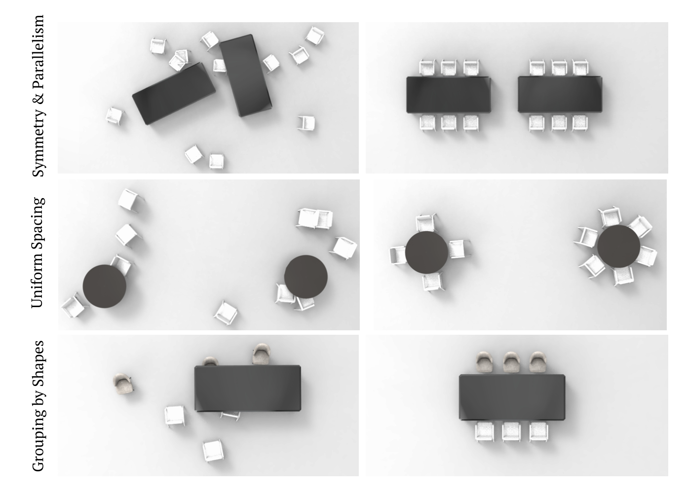


<br>

---
<br>


## Training
### 3D-FRONT
To train for 3D-FRONT livingroom (or bedroom by changing `room_type`):
```
python train.py  --train 1  --train_epoch 500000  --train_pos_noise_level_stddev 0.1 --train_ang_noise_level_stddev 0.26179939  --data_type 3dfront  --room_type livingroom
```

### Synthetic table chair
To train for tablechair_horizontal, tablechair_circle, tablechair_shape (with corresponding `data_type`):
```
python train.py  --log 1 --train 1  --train_epoch 100000  --train_pos_noise_level_stddev 0.25 --train_ang_noise_level_stddev 0.78539816  --data_type tablechair_horizontal
```


<br>


## Inference
### 3D-FRONT
To run inference for 3D-FRONT livingroom (or bedroom by changing `room_type`):
```
python train.py  --log 1 --train 0  --model_path <full-path-to-model> --normal_denoisng 1 --data_type 3dfront  --room_type livingroom
```

Ground Truth            |  Initial |  Denoised
:-------------------------:|:-------------------------: |:-------------------------:
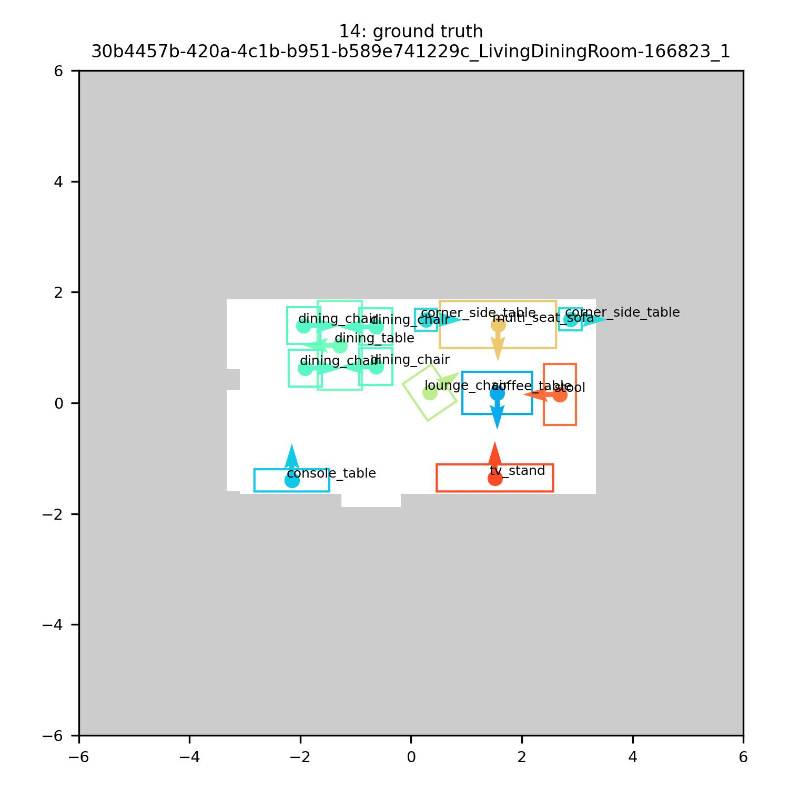  |  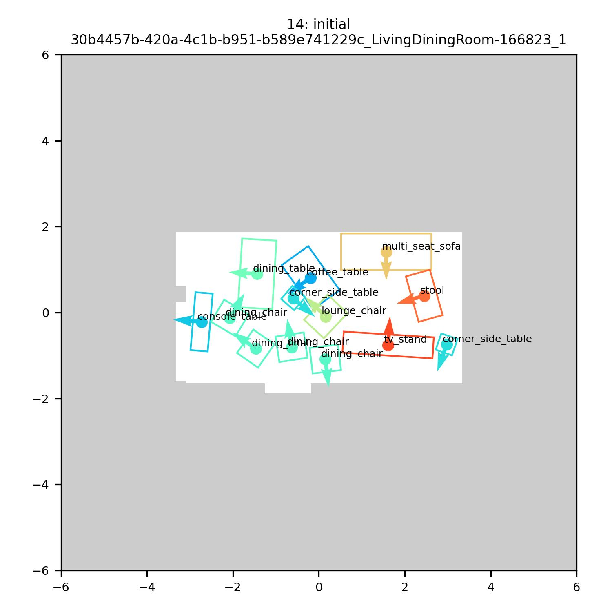 | 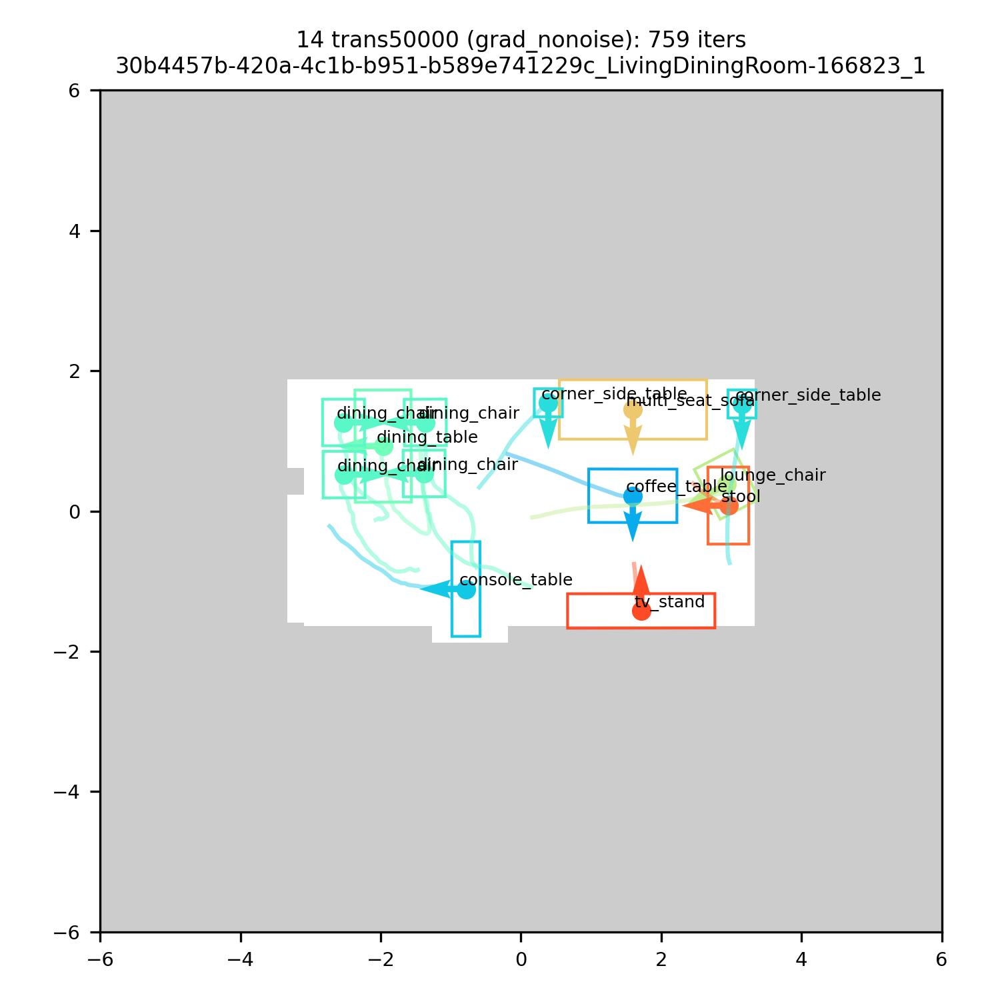

<br>

### Synthetic table chair
To run inference for tablechair_horizontal, tablechair_circle, tablechair_shape (with corresponding `data_type`):
```
python train.py  --log 1 --train 0  --model_path <full-path-to-model> --normal_denoisng 1 --data_type tablechair_horizontal
```

Circle   |  Horizontal   |  Shape
:-------------:|:---------------:|:--------------:
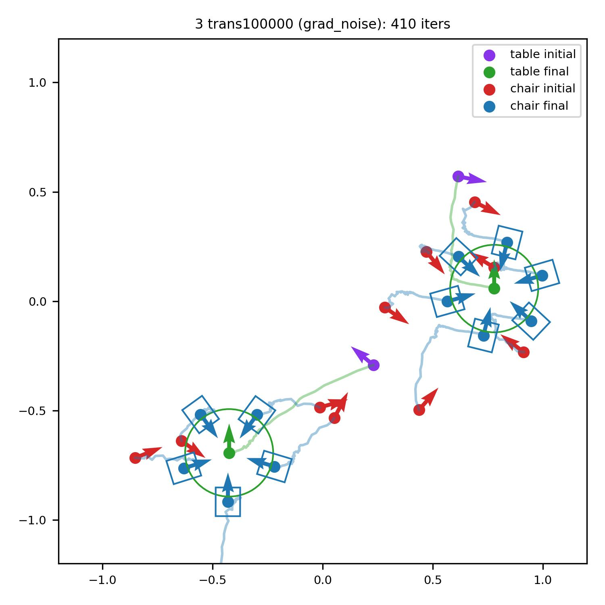  |  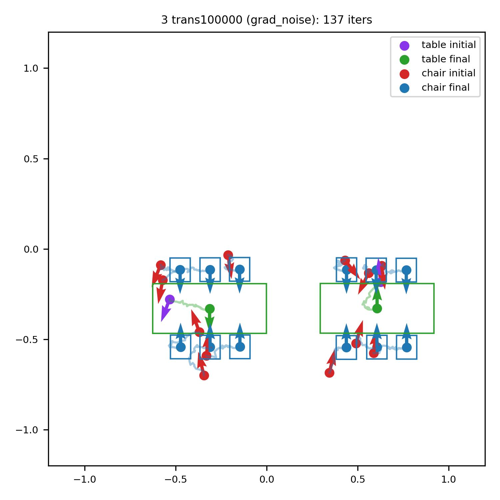 | 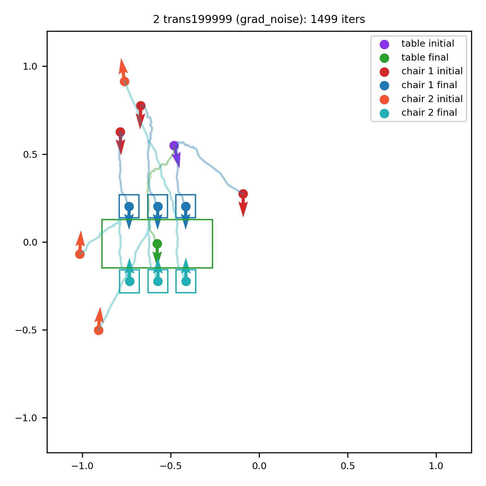


<br>


## Flag Specifications
A complete list of flags for ``train.py`` can be found in the file. The most relevant ones are listed below. 

| Flag | Description |
| ----------- | ----------- |
| log (int) | If 1, write to log file in addition to printing to stdout. |
| train (int) | Binary flag for train versus inference. |
| model_path (str) | If train==1 && resume_train==1, serves as the model path from which to resume training; otherwise, serves as the model to use for inference. | 
|  |  |
| resume_train (int) | Training specific. If 1, resume training from model_path passed in. |
| train_epoch (int) | Training specific. Number of epoches to train for. | 
| train_pos/ang_noise_level_stddev (float)| Training specific. Standard deviation of the Gaussian distribution from which the training data position/angle noise level (stddev of actual noise distribution) is drawn |            
|  |  |
| normal_denoisng (int) | Inference specific. If 1, will do general purpose inference. | 
| stratefied_mass_denoising (int) | Inference specific. If 1, will do inference with stratefied noise levels, no visualization, same set for all noise level. For use cases such as FID/KID/analysis.| 
| random_mass_denoising (int) | Inference specific. If 1, will do inference for a wide range of noise levels and scenes. For use cases such as examining qualitative performance. | 
| denoise_weigh_by_class (int) | Inference specific. 3D-FRONT specific. If 1, in inference data generation, objects with higher volume will move less. |
| denoise_within_floorplan (int) | Inference specific. 3D-FRONT specific. If 1, in inference data generation, objects must be within boundary of floor plan. |
| denoise_no_penetration (int) | If 1, in inference data generation, objects cannot intersect one another (or only minimally). |
|||
| data_type (str)| <ul><li>tablechair_horizontal: 2 tables with 6 chairs each in rectangular formation (fixed relative distance).</li><li>tablechair_circle: 2 tables with 2-6 chairs each in circular formation. </li></li><li>tablechair_shape: 1 table with 6 chairs of 2 types, one type on each side. </li> </li><li> 3dfront: 3D-FRONT dataset (professionally designed indoor scenes); currently support bedroom and livingroom.</li></ul> |
|room_type (str) | 3D-FRONT specific. {bedroom,livingroom}. | 


<br>

---
<br>

## Evaluation

### Success Rate
For checking success rate of methods and earth mover's distance to ground truth. See paper for details.

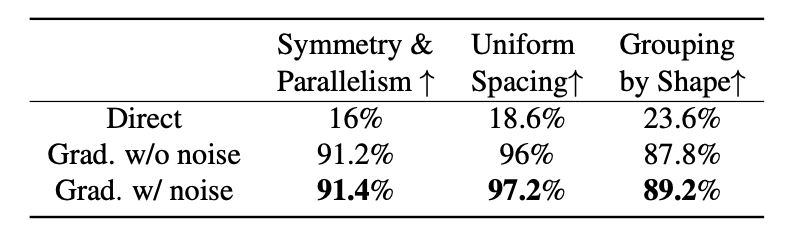
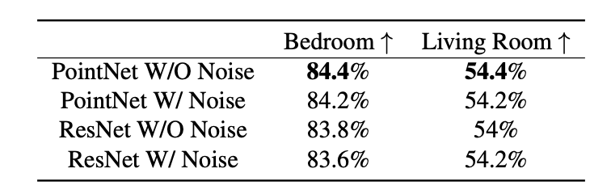
<br>

Example usage:

```
python eval/denoise_res_eval.py --data_type tablechair_horizontal --res_filepath <pos0.1_ang15_train50000.npz>
```
```
python eval/denoise_res_eval.py --data_type 3dfront --res_filepath <pos0.1_ang15_train50000.npz> --room_type livingroom
```
<br>

Detailed usage:
```
usage: denoise_res_eval.py [-h]
                           [--data_type {tablechair_horizontal,tablechair_circle,tablechair_shape,3dfront}]
                           [--res_filepath RES_FILEPATH]
                           [--room_type {bedroom,livingroom}]

optional arguments:
  -h, --help            show this help message and exit
  --data_type {tablechair_horizontal,tablechair_circle,tablechair_shape,3dfront}
                        
                                                        -tablechair_horizontal: 2 tables with 6 chairs each in rectangular formation (fixed relative distance).
                                                        -tablechair_circle: 2 tables with 2-6 chairs each in circular formation.
                                                        -tablechair_shape: 1 table with 6 chairs of 2 types, one type on each side.
                                                        -3dfront: 3D-FRONT dataset (professionally designed indoor scenes); currently support bedroom and livingroom.
                                                        
  --res_filepath RES_FILEPATH
                        filepath of npz file saved from denoise_meta() in train.py.
  --room_type {bedroom,livingroom}
                        3D-FRONT specific.
```

<br>

### Integer Relations

For checking number of integer relations satisfied by 3D-FRONT scene. See paper for details.
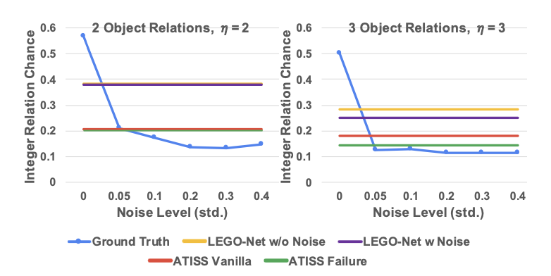
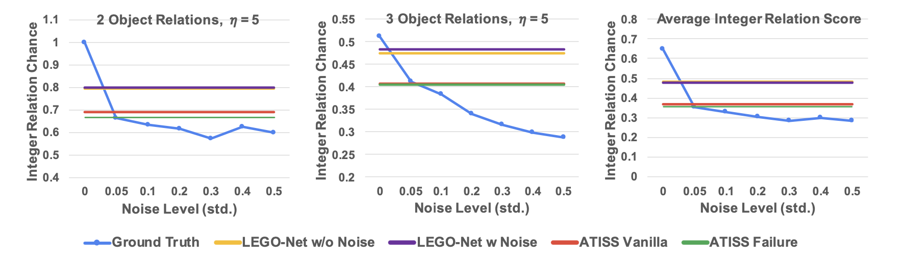


<br>

Example usage:
```
python eval/integer_relations.py --res_filepath <pos0.1_ang15_train50000.npz> --room_type livingroom --denoise_method grad_noise
```
<br>

Detailed usage:
```
usage: integer_relations.py [-h] [--log LOG] [--res_filepath RES_FILEPATH]
                            [--room_type {bedroom,livingroom}]
                            [--denoise_method {direct_map_once,direct_map,grad_nonoise,grad_noise}]

optional arguments:
  -h, --help            show this help message and exit
  --log LOG             If 1, write to log file in addition to printing to stdout.
  --res_filepath RES_FILEPATH
                        filepath of npz file saved from denoise_meta() in train.py.
  --room_type {bedroom,livingroom}
                        3D-FRONT specific.
  --denoise_method {direct_map_once,direct_map,grad_nonoise,grad_noise}
                        which inference method to evaluate.
```


<br>

---
<br>

## Visualization
### 3D-FRONT
To visualize with bounding boxes:

```
    tdf=TDFDataset("livingroom", use_augment=False)

    sceneid = "b9d17d23-66f0-445d-acb7-f11887cc4f7f_LivingDiningRoom-192367"
    input, scenepath = tdf.read_one_scene(scenepath=sceneid)
    tdf.visualize_tdf_2d(input, f"TDFront_{sceneid}.jpg", f"Original", traj=None, scenepath=scenepath, show_corner=False)
```
Complete code can be found in ``data/TDFront.py`` <br>

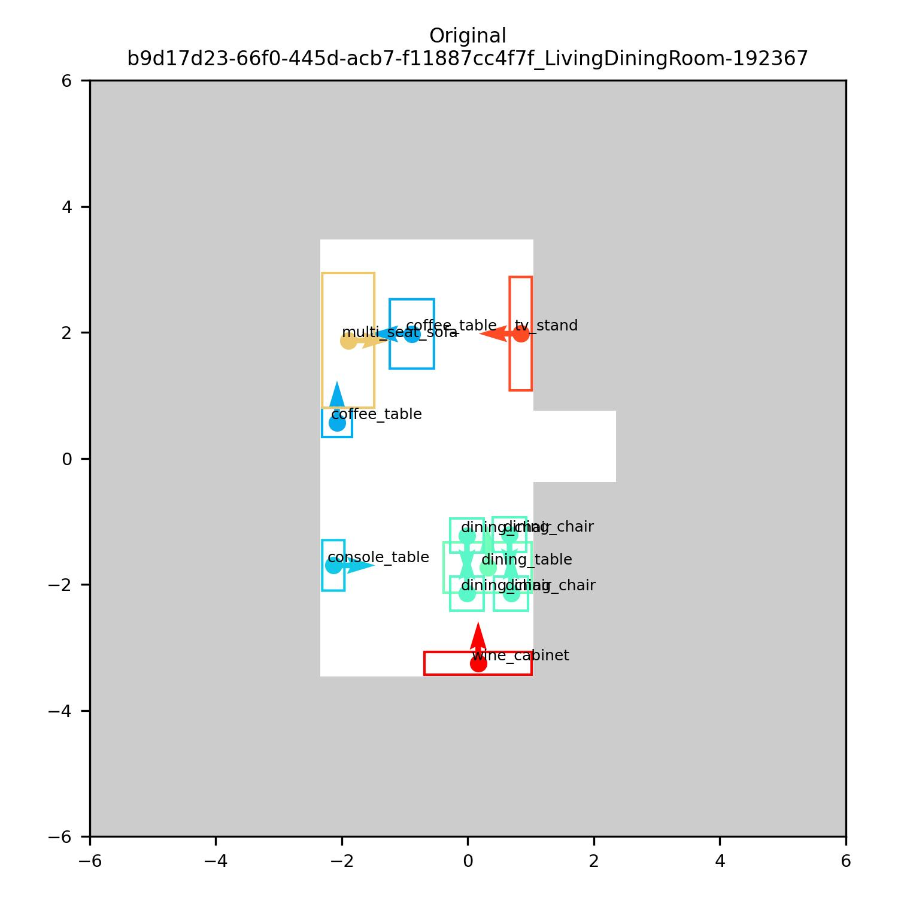

<br> 

To produce realistic renderings, one must download the original 3D-FRONT dataset. 

<br>


### Synthetic table chair
To visualize example data samples:

```
python tablechair_circle.py
``` 
Clean          |  Messy 
:-------------------------:|:-------------------------: |
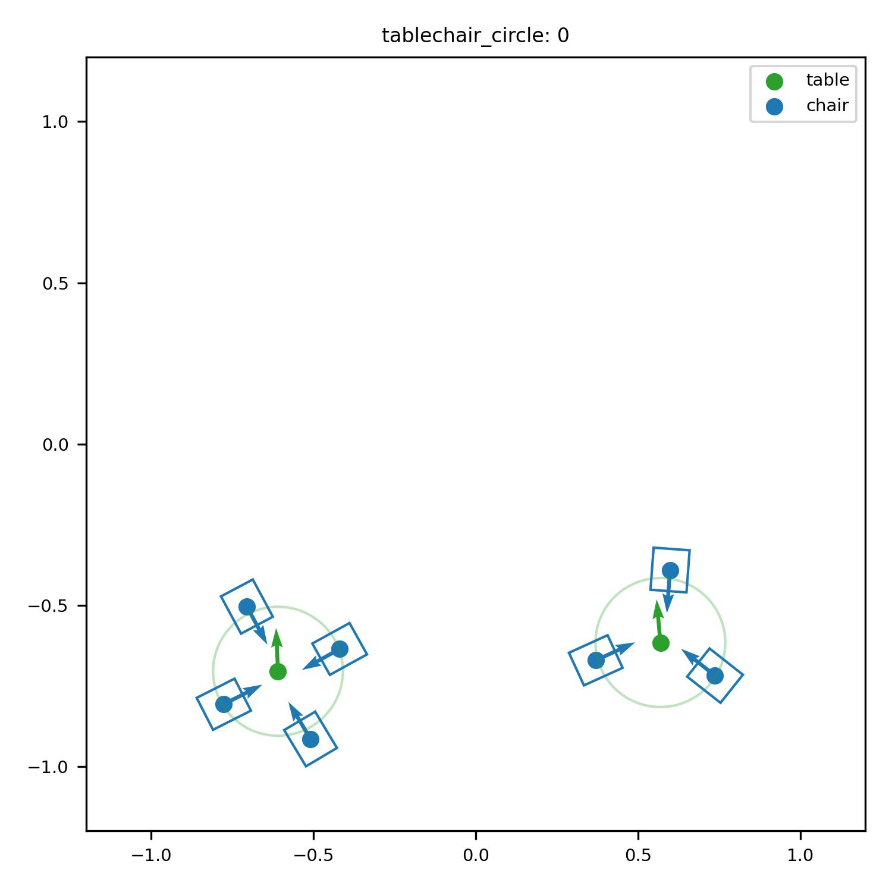  |  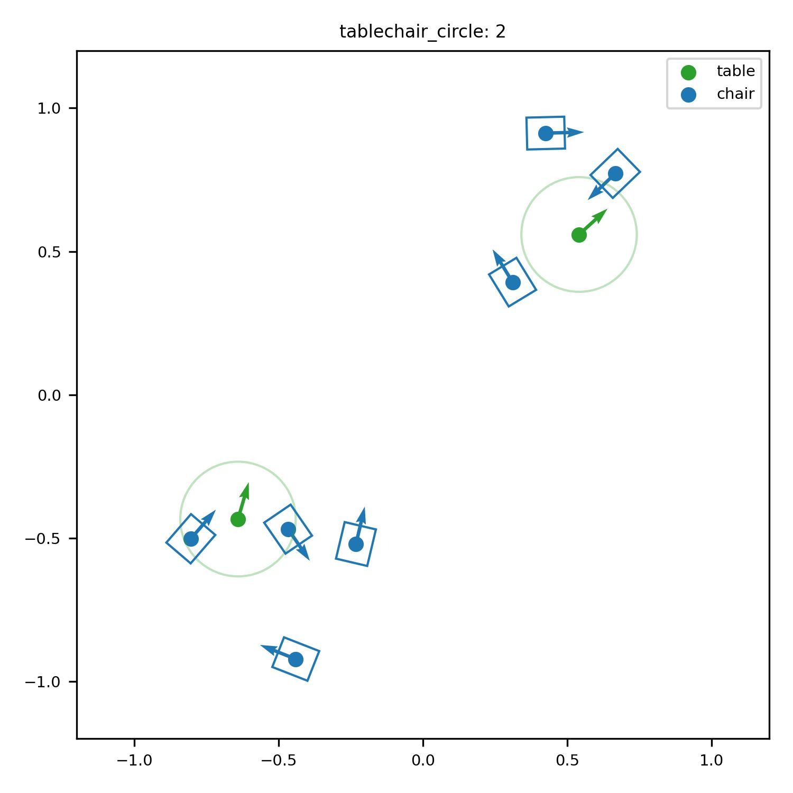 | 


```
python tablechair_horizontal.py
``` 
Clean          |  Messy 
:-------------------------:|:-------------------------: |
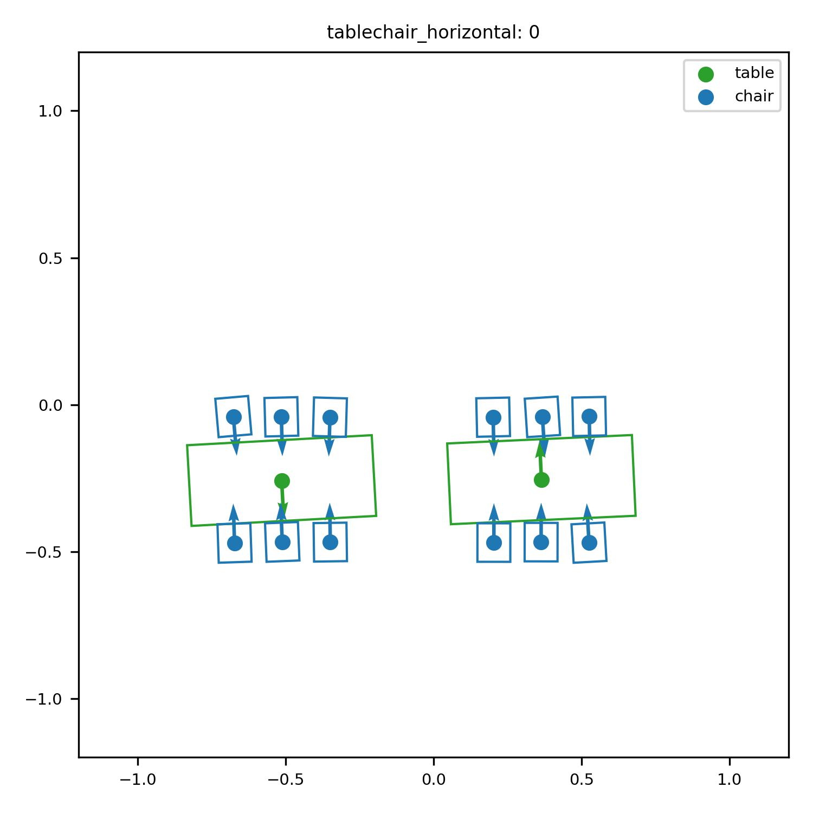  |  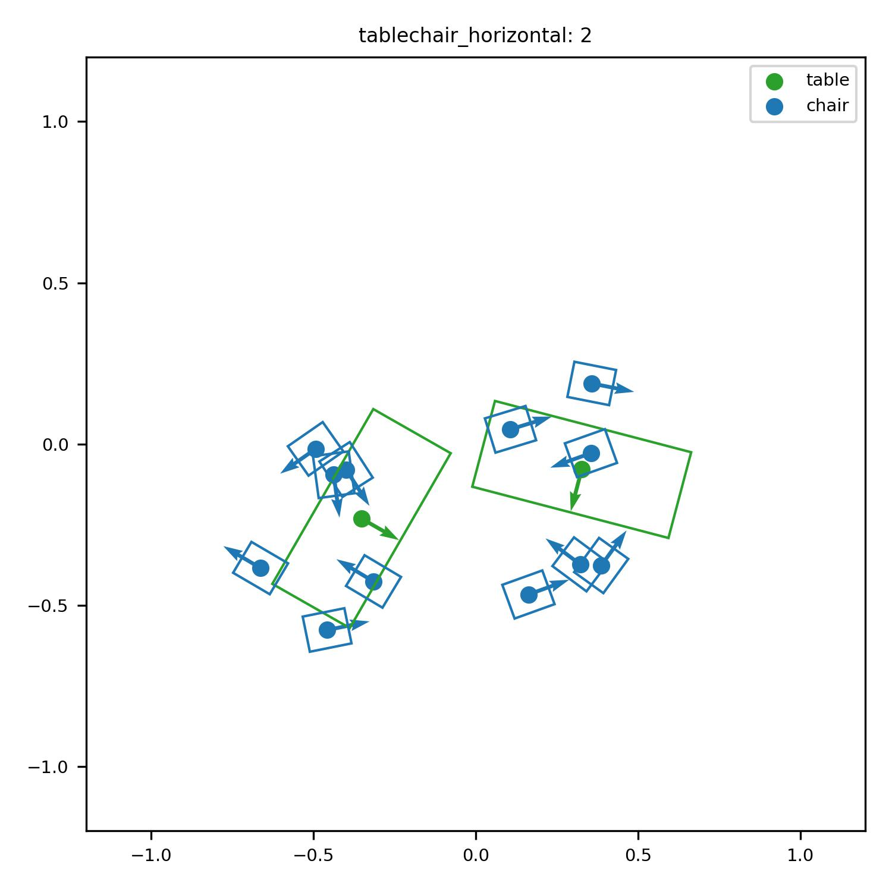 | 


```
python tablechair_shape.py
``` 

Clean          |  Messy 
:-------------------------:|:-------------------------: |
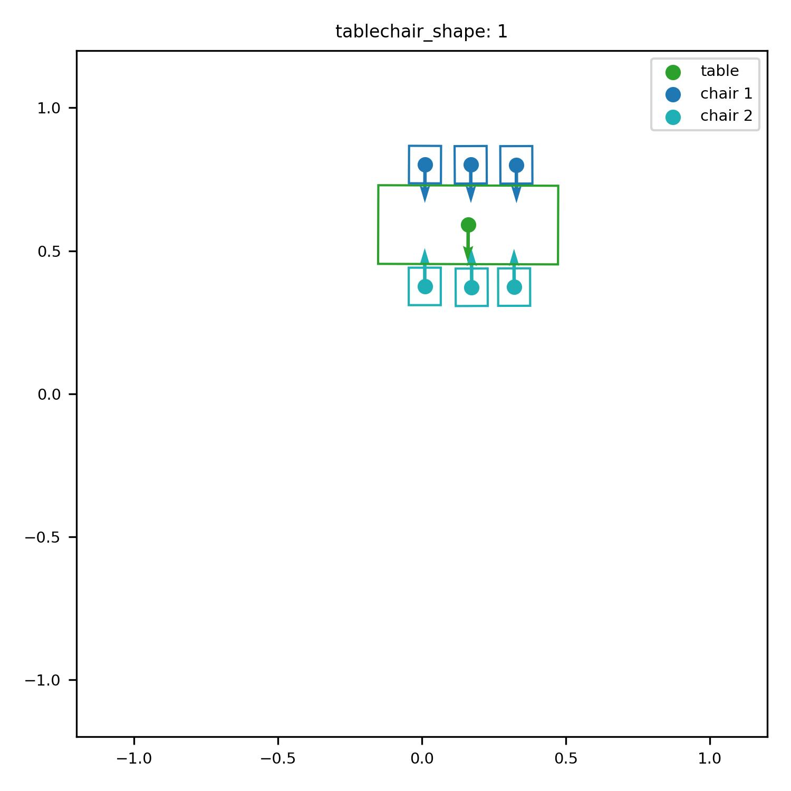  |  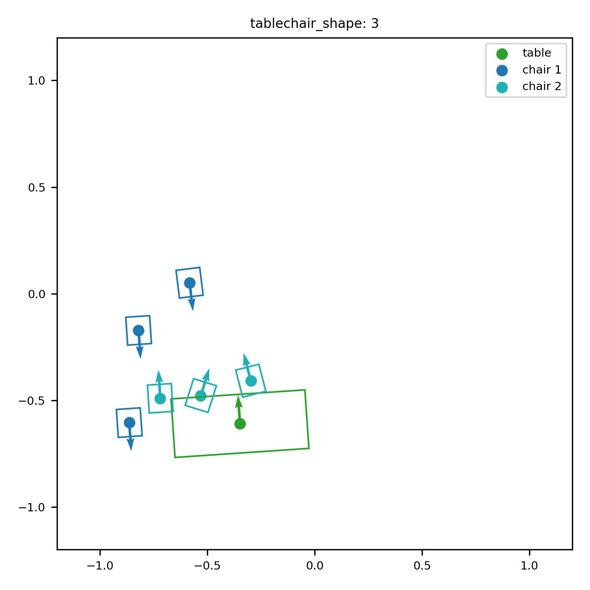 | 